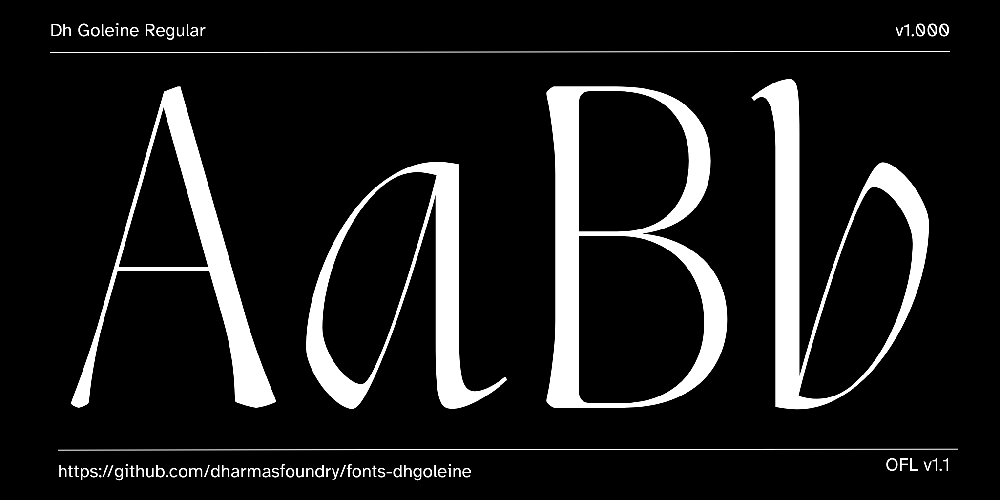
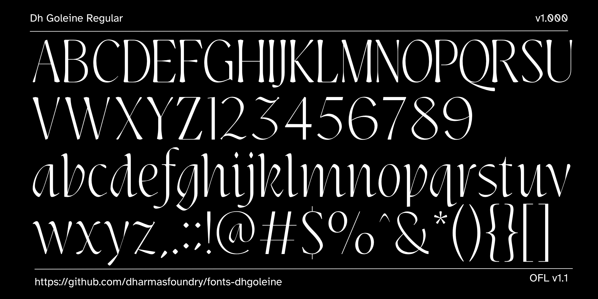

# Dh Goleine

[![][Fontspector]](https://dharmasfoundry.github.io/fonts-dhgoleine/fontspector/fontspector-report.html)

[Fontspector]: https://img.shields.io/endpoint?url=https%3A%2F%2Fdharmasfoundry.github.io%2Ffonts-dhgoleine%2Fbadges%2FFontspectorQA.json

Dh Goleine is a contemporary serif typeface designed for versatility and elegance. Available in 8 weights — Thin to ExtraBold — each with a matching Italic, making it suitable for branding, editorial, and digital interfaces.

## About

Designed by Irzad Norandito for Dharmas Foundry (dharmasfoundry.com), an independent type foundry based in Malang, Indonesia, founded by Jamaludin Achmad Sahestya Dharma.

## Building

Fonts are built automatically by GitHub Actions — take a look in the "Actions" tab for the latest build.

If you want to build fonts manually on your own computer:

- `make build` will produce font files.
- `make test` will run [Fontspector](https://fonttools.github.io/fontspector/)'s quality assurance tests.
- `make proof` will generate HTML proof files.

## Changelog

**18 August 2026. Version 1.000**

- INITIAL Initial release with 16 styles (Thin to ExtraBold with Italics).

## License

This Font Software is licensed under the SIL Open Font License, Version 1.1.
This license is available with a FAQ at https://openfontlicense.org

## Repository Layout

This font repository structure is inspired by [Unified Font Repository v0.3](https://github.com/unified-font-repository/Unified-Font-Repository), modified for the Google Fonts workflow.